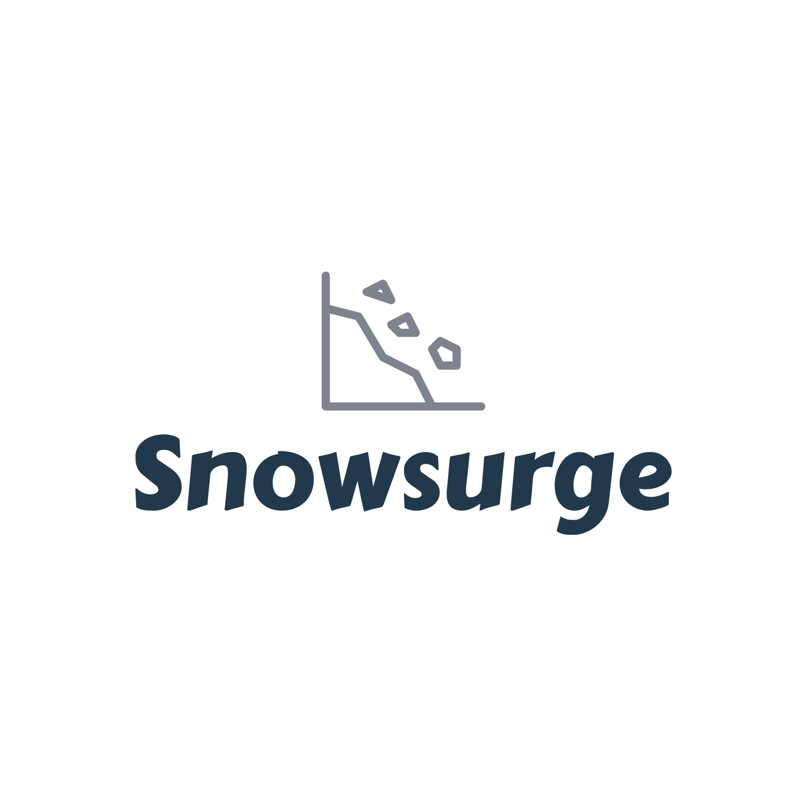
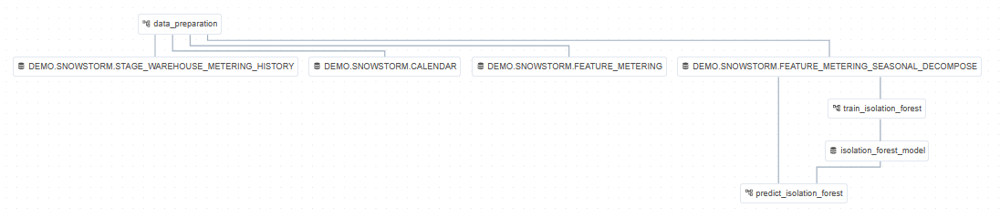
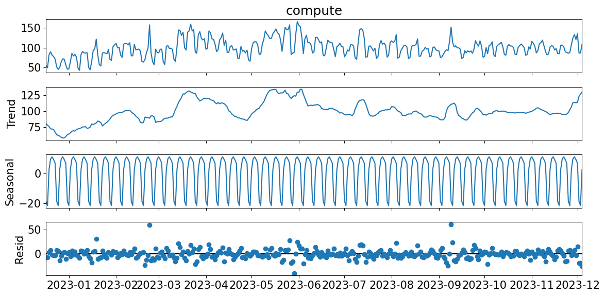
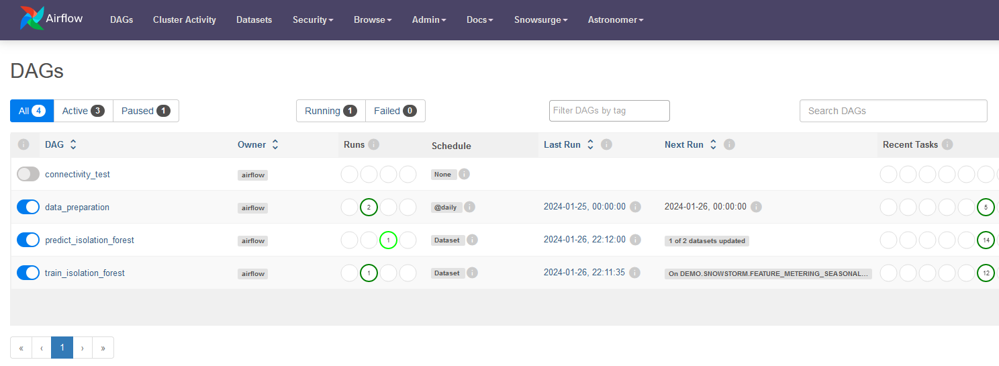
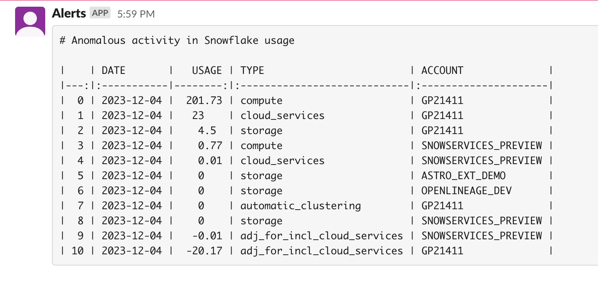
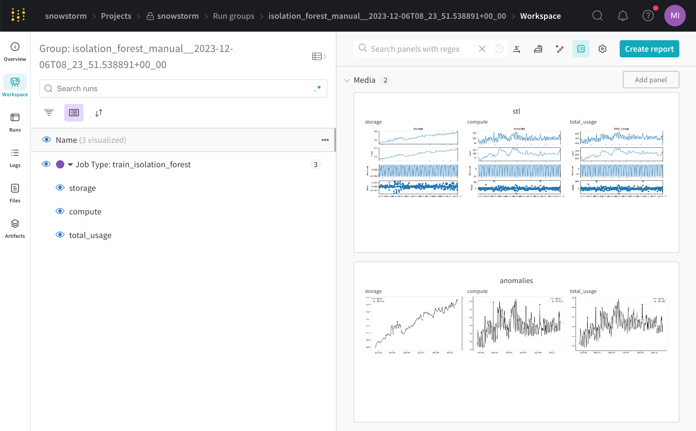
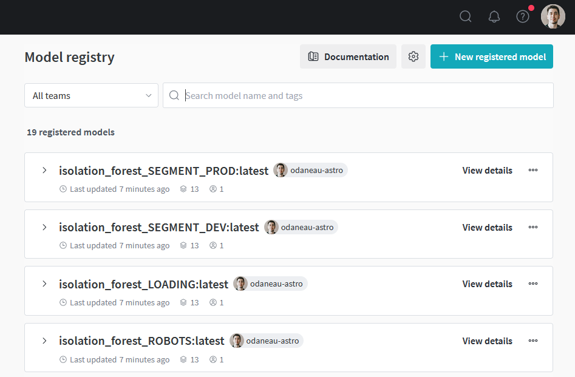

<p align="center">
  
</p>

# Snowpatrol

Snowpatrol is an application for anomaly detection and alerting of Snowflake usage powered by Machine Learning.
Additionally, this application provides a reference implementation and template for Machine Learning Operations (MLOps)
with Apache Airflow.


## MLOps Themes

In addition to implementing a specific use-case. This reference implementation provides a framework for general
implementation of MLOps. As such there are a couple of themes present in the framework which can be extended (or not
used if appropriate) for use-case specific needs.

<br clear="left"/>

### Operationalize models while allowing Data Scientist choice.

For MLOps the focus is on deployment, scoring, evaluation, monitoring, alerting and periodic retraining of models.
As such we assume that Data Scientists have used their tool of choice for data exploration, model development and
experimentation. The starting point may be a Jupyter notebook or other code provided by a Data Scientist and
checked into a code repository. You will find the starter notebook for this project in the `notebooks` folder.

<p></p>

### Use [Data aware scheduling](https://docs.astronomer.io/learn/airflow-datasets) to separate workflows based on various scheduling requirements.

It will often be necessary to schedule data engineering, feature engineering and, model training, evaluation, prediction
and monitoring at different intervals. Data engineering tasks may be run hourly (often by a separate team) with nightly
feature engineering and weekly
inference. Likewise, model training may be triggered manually when monitoring workflows identify a need for retraining.
Creating
separate Airflow DAGs for each of these workflows allows them to be scheduled individually as idempotent units of work.
These workflows are, however, inter-related and Airflow's Data-aware Scheduling with Datasets allows DAG execution to
occur in relation to other DAGs.

### Use [Dynamic Tasks](https://docs.astronomer.io/learn/dynamic-tasks) to parallelize workflows.

Airflow is well suited for efficiently running tasks in parallel. Hyperparameter optimization, A/B testing, training
champion/challenger models or training many unit-specific models (i.e. forecasting models for many individual
components)
all benefit from parallelization. Airflow's Dynamic Task mapping makes it possible to easily iterate over a list of ML
operations.

### Score in batch.

While some use cases require low-latency inference and online scoring many will be most efficient with batch scoring.
Airflow supports batch scoring at various intervals. Model predictions can be made in Airflow tasks by importing a model
or by REST calls to a deployed endpoint.

### Leverage centralized auditing and lineage.

By combining MLOps with the rest of an organization's Data Ops Airflow provides a single view to assist in
reproducibility and explainability. With the ability to track backwards from model predictions to model training and the
datasets that were used ML Engineers and Data Scientists can more easily identify issues or perform post-mortem
analysis.

### Integrate with model registries and ML tools of choice

ML models are "living software" requiring the ability to track state over time. Many teams will leverage model
registries like [Weights and Biases](https://wandb.ai) or [MLFlow](https://mlflow.org). Airflow integrates well with
these services and allows logging models after training and downloading models during scoring. Many Airflow providers
are available for tools
like [SageMaker](https://registry.astronomer.io/modules?query=sagemaker), [VertexAI](https://registry.astronomer.io/modules?query=vertexai), [AzureML](https://github.com/Azure/airflow-provider-azure-machinelearning)
and [Databricks](https://registry.astronomer.io/providers/apache-airflow-providers-databricks/). Additionally, many NLP
use cases will rely on a vector database and Airflow includes providers for services
like [Weaviate](https://registry.astronomer.io/providers/apache-airflow-providers-weaviate), [Pinecone](https://registry.astronomer.io/providers/apache-airflow-providers-pinecone), [pgvector](https://registry.astronomer.io/providers/apache-airflow-providers-pgvector), [OpenSearch](https://registry.astronomer.io/providers/apache-airflow-providers-opensearch)
as well as LLM providers like [OpenAI](https://registry.astronomer.io/providers/apache-airflow-providers-openai)
and [Cohere](https://registry.astronomer.io/providers/apache-airflow-providers-cohere).

## Project Structure

### Business Objective

Cloud-based services like Snowflake provide many benefits to organizations by simplifying operations, reducing cost and
delays and enabling self-service for many teams. However, this added agility and self-service empowerment can result in
unexpected costs despite good governance processes.

This project aims to identify anomalous usage activity in order to allow management and timely correction of activities.

### Modeling

Snowflake users incur costs for compute, storage, marketplace and various other services. Of these, compute is the most
significant. Data exploration and experimentation was performed (
see [notebook](notebooks/snowpatrol.ipynb)) to evaluate the ability to identify anomalies for all warehouses.
While storage usage can increase quickly the relative cost is not significant (<1% of total billing).
Production models, therefore, will monitor compute usage specifically.

<p align="center">
  
</p>

Without specific labeled data we will use an unsupervised approach with an [Isolation Forest]() model. Separate models
will be trained for each warehouses using dynamic tasks. Because the usage demonstrates both seasonality and
increasing trend the model will be trained on decomposed residuals factoring out both seasonality and trend.
<br clear="left"/>

### DAGs

This project separates all the steps of the ML pipeline into 3 different Dags.
`Data Preparation` handles data extraction, transformation and feature engineering.
`Train Isolation Forest` handles drift detection and model training
`Predict Isolation Forest` handles predictions, monitoring and alerting.

<p align="center"></p>

Note: For this use-case the DAGs are very small with only a couple of tasks each. As a reference implementation the
use-case was selected because of its simplicity and to highlight the framework without distractions of the specific
use-case.

#### Data Engineering

Snowflake runs nightly jobs to capture usage statistics for billing (see Dataset section below.). However, the usage
data is only available to administrators by default. Additionally there are different levels of aggregation which happen
at the "organization" and "account" levels. The data engineering DAG extracts organization-level usage
to the project's schema and database for access by non-admin users.

##### Data Validation

Data validation is performed after the raw data is sourced from Snowflake views.
This is to ensure that no data is missing before we perform feature engineering and model training.
In the future, Soda Core and Great Expectations could be leveraged for further data validation.

#### Feature Engineering

Usage data is comprised of usage across one or more accounts within the Snowflake Organization. Models will be trained
on all warehouses at the organization level. The feature engineering task is part of the data preparation DAG.

#### Model Training

Multiple models and model instances are trained and stored in the model catalog with versioning. Downstream inference
tasks will use the `latest` tag.

- Champion Model:  The baseline Isolation Forest model training is triggered manually for the initial model and uses
  dynamic tasks to train models.
- Challenger Model: In a future phase of this project, the champion model will be retrained periodically and a
  challenger model will be trained with hyperparameter optimization. The challenger model will be evaluated and
  promoted to champion if it outperforms the current champion.

##### Data Drift detection

Prior to training a new model, the training DAG will check for data drift using KS.
If the usage data for a particular warehouse as drifted compared to the historical data, the model will be flagged to be retrained.

It is possible to bypass this check by setting the `force_retrain` parameter to `True` in the DAG.
This forces the model to be retrained regardless of the drift detection results.

#### Predictions and Alerting

Predictions are made in batch with dynamic tasks for each model instance. Identified anomalies are grouped and a report
is generated in Markdown format. Alerts are sent as Slack messages for notification.
<p>
  
</p>
<br clear="center"/>

#### Model Evaluation

todo

#### Model and Data Monitoring

todo

### Data

This project uses pre-computed data which is available in the `SNOWFLAKE` scheme for all accounts.
The `SNOWFLAKE.ORGANIZATION_USAGE.WAREHOUSE_METERING_HISTORY` [view](https://docs.snowflake.com/en/sql-reference/organization-usage/warehouse_metering_history)
is updated nightly with metering data for all warehouses in the main account of the organization.

### Experiment Tracking

<p>
  
</p>

This project uses [Weights and Biases](https://wandb.ai/snowpatrol/snowpatrol) for experiment and model tracking.
The DAG run_id of the training DAG to group all model instances together. Each model has an `anomaly_threshold`
parameter which is `threshold_cutoff` (default is 3) standard deviations from the mean of the stationary (decomposed
residual) scored data. Additionally, artifacts are captured to visualize the seasonal decomposition and the anomaly
scores of the training data. These are logged to the Weights and Biases project along with the model and
anomaly_threshold metric.

The link to the WANDB "run" is listed in the task logs. Future work will include integrations with a new provider which
will cross-link WandB runs with DAG runs.

<br clear="right"/>

### Model Registry

<p>
  
</p>

Successful runs of the training DAG tag models as "latest" in the [Model Registry](https://wandb.ai/registry/model).
Downstream DAGs use the "latest" tag for scoring, evaluation and monitoring. Future work will include CI/CD integrations
which notify administrators of a new model for manual promotion to "latest".

<br clear="right"/>

## Project Setup

### Prerequisites

To use this template you need the following:

- Docker Desktop or similar Docker services running locally with the docker CLI installed.
- [Weights and Biases account](https://wandb.ai/signup) and an API KEY.
- [Snowflake account](https://trial.snowflake.com/?owner=SPN-PID-365384) with ADMIN access
- [Astronomer account](https://www.astronomer.io/try-astro/)
- A [Slack app](https://api.slack.com/apps/) in the channel to be notified with an `xoxb-` oauth token with `chat:write`
  permissions.

### Setup

1. Install Astronomer's [Astro CLI](https://github.com/astronomer/astro-cli). The Astro CLI is an Apache 2.0 licensed,
   open-source tool for building Airflow instances and provides the fastest and easiest way to be up and running with
   Airflow in minutes. The Astro CLI is a Docker Compose-based tool and integrates easily with Weights and Biases for a
   local
   developer environment.

   To install the Astro CLI, open a terminal window and run:

   For MacOS
    ```bash
    brew install astro
    ```

   For Linux
    ```bash
    curl -sSL install.astronomer.io | sudo bash -s
    ```

2. Clone this repository:
    ```bash
    git clone https://github.com/astronomer/snowpatrol
    cd snowpatrol
    ```

   3. Create a file called `.env` with the following connection strings and environment variables.
      To make this easier, we have included a .env.example file that you can rename to .env.

       - `WANDB_API_KEY`: The API KEY should have access to the Weights and Biases `snowpatrol` entity and `snowpatrol`
         project.
         Example:
         ```
         WANDB_API_KEY:'xxxxxxxxxxx'
         ```

       - `AIRFLOW_CONN_SNOWFLAKE_ADMIN`: This connection string is used for extracting the usage data to the project
         schema.
         Orgadmin role is not specifically needed but the user should have access to a role with permissions to read
         the `SNOWFLAKE.ORGANIZATION_USAGE.USAGE_IN_CURRENCY_DAILY` [view](https://docs.snowflake.com/en/sql-reference/organization-usage/usage_in_currency_daily)
         Example:
         ```
         AIRFLOW_CONN_SNOWFLAKE_ADMIN='{"conn_type": "snowflake", "login": "<>", "password": "<", "schema": "<", "extra": {"account": "<>", "warehouse": "<>", "role": "ORGADMIN", "authenticator": "snowflake", "application": "AIRFLOW"}}'
         ```

       - `AIRFLOW_CONN_SLACK_API_ALERT`: Add a Slack token for sending Slack alerts.
         Example:
         ```
         AIRFLOW_CONN_SLACK_API_ALERT='{"conn_type": "slack", "password": "xoxb-<>"}'
         ```

4. Start Apache Airflow
    ```sh
    cd airflow
    astro dev start
    ```

   After Airflow starts a browser window that should open to [http://localhost:8080](http://localhost:8080). Log in with
   the following credentials:
    - **username**: `admin`
    - **password**: `admin`

5. Run the `data_preparation` DAG:
   After the `data_preparation` DAG runs it will trigger the `train_isolation_forest` DAG.

6. After the `data_preparation` and `train_isolation_forest` DAGs run, Airflow will trigger the `predict_isolation_forest` DAG.

7. Deploy to Astro:
   Complete the following steps to promote from Airflow running locally to a production deployment in Astro.
    - Log in to Astro from the CLI.
    ```bash
    astro login
    ```
    - [Deploy](https://docs.astronomer.io/astro/deploy-code) the Astro project.
    ```bash
    astro deployment create -n 'snowpatrol'
    astro deployment variable update -lsn 'snowpatrol'
    astro deploy -f
    ```

   The `variable update` will load variables from the `.env` file that was created in step #3.

8. Login to astro and ensure that the `data_preparation` DAG is unpaused. Every night
   the `data_preparation`, `train_isolation_forest` and `predict_isolation_forest` DAGs will run. Alerts
   will be sent to the channel specified in `slack_channel` in the `predict_isolation_forest` and `monitoring`
   DAGs.

## Feedback

Give us your feedback, comments and ideas at https://github.com/astronomer/snowpatrol/discussions
