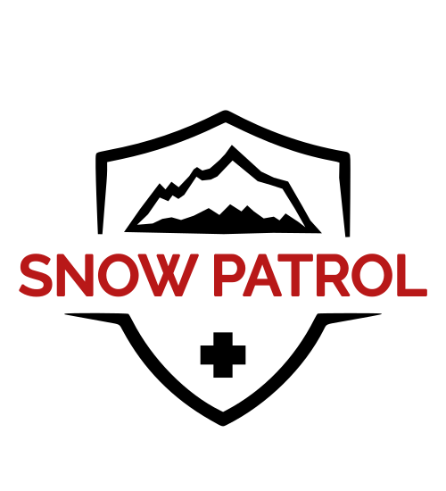
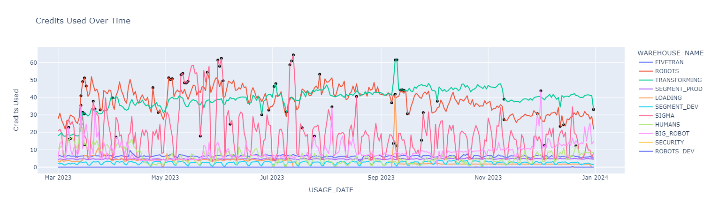
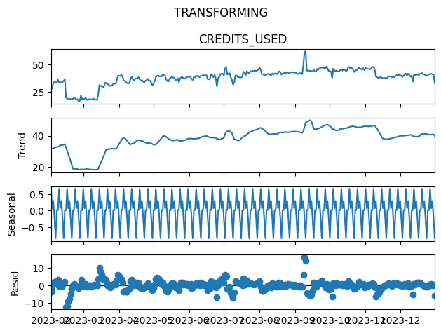
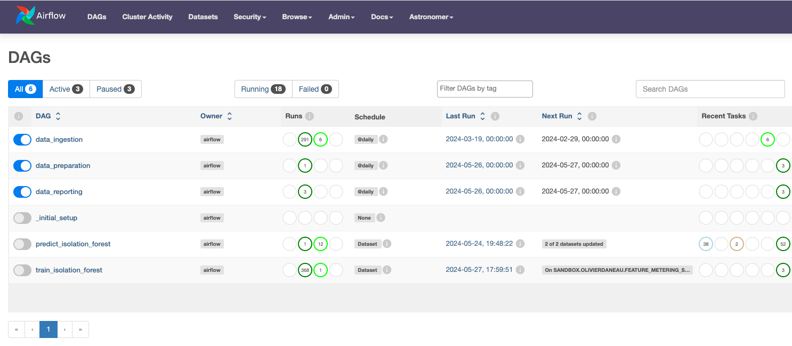
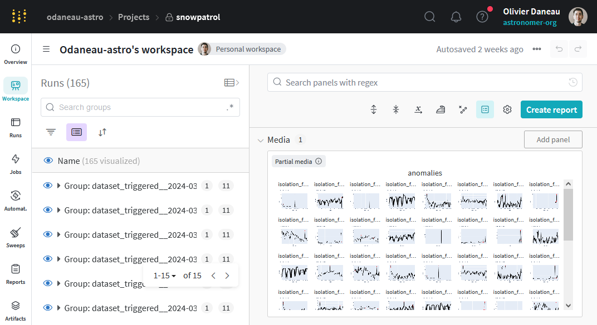
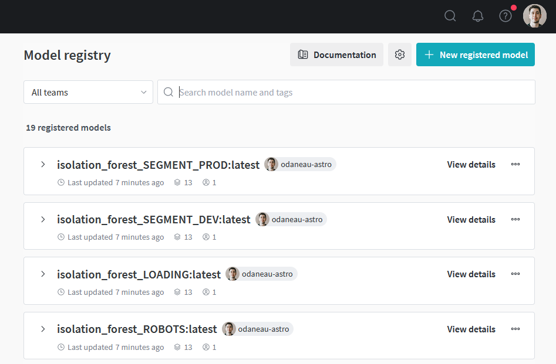

<p align="center">
  
</p>

# SnowPatrol

SnowPatrol is an open-source application for managing cloud costs.
SnowPatrol offers a reference implementation for MLOps on Airflow to manage the training, testing, deployment, and monitoring of a predictive model of Snowflake spend.

At Astronomer, we firmly believe in the power of open source and sharing knowledge.
We are excited to share this MLOps reference implementation with the community and hope it will be useful to others.



## Project Structure

### Business Objective

Astronomer is a data-driven company, and we rely heavily on Snowflake to store and analyze our data. Self-service analytics is a core part of our culture, and we encourage our teams to answer questions with data themselves, either by running SQL queries or building their own data visualizations. As such, a large number of users and service accounts run queries on a daily basis; on average more than 900k queries are run daily. The majority of these queries come from automated Airflow DAGs running on various schedules. Identifying which automated process or which user ran a query causing increased usage on a given day is time-consuming when done manually. We would rather not waste time chasing cars.
Cost management is also a key part of our operations. Just like most organizations, we want to avoid overages and control our Snowflake costs. While that is a common goal, it can be challenging to achieve. Snowflake costs are complex and can be attributed to a variety of factors.


SnowPatrol aims to identify anomalous usage activity in order to allow management and timely correction of activities.

### Modeling

Snowflake users incur costs for compute, storage, marketplace and various other services. Of these, compute is the most
significant. Data exploration and experimentation was performed (see [notebook](notebooks/snowpatrol.ipynb)) to evaluate the ability to identify anomalies for all warehouses.
While storage usage can increase quickly the relative cost is not significant (<1% of total billing).
Production models, therefore, will monitor compute usage specifically.

<p align="center">
  
</p>

Without specific labeled data we will use an unsupervised approach with an [Isolation Forest](https://en.wikipedia.org/wiki/Isolation_forest) model. Separate models
will be trained for each warehouses using dynamic tasks. Because the usage demonstrates both seasonality and
increasing trend, the model will be trained on decomposed residuals factoring out both seasonality and trend.
<br clear="left"/>

### DAGs

This project separates all the steps of the ML pipeline into 3 different Dags.
`Data Preparation` handles data extraction, transformation and feature engineering.
`Train Isolation Forest` handles drift detection and model training
`Predict Isolation Forest` handles predictions, monitoring and alerting.

<p align="center"></p>


#### Data Preparation

Snowflake performs nightly updates to the metering statistics and makes the data available in the `WAREHOUSE_METERING_HISTORY` table.
While we could use the tables directly, the data is truncated daily and only the last 365 days are kept.
The data preparation DAG extracts organization-level metering data, cleans it up and accumulates it so we have a full history. To keep things simple, data validation and feature engineering are done as part of the same DAG.

Data validation is performed after the raw data is sourced from Snowflake views.
This is to ensure that no data is missing before we perform feature engineering and model training.
In the future, Soda Core and Great Expectations could be leveraged for further data validation.

Metering data comprises usage across one or more accounts within the Snowflake Organization. Models will be trained
on each warehouses at the organization level. The feature engineering task is part of the data preparation DAG.

#### Model Training

Multiple models and model instances are trained and stored in the model catalog with versioning. Downstream inference
tasks will use the `latest` tag.

Isolation Forest model training is triggered using data-aware scheduling and will start as soon as data preparation datasets are available.
The DAG uses dynamic tasks to train models for each warehouse.

Prior to training a new model, the training DAG will check for data drift using KS.
If the Metering data for a particular warehouse has drifted compared to the historical data, the model will be flagged to be retrained.

It is possible to bypass this check by setting the `force_retrain` parameter to `True` in the DAG.
This forces the model to be retrained regardless of the drift detection results.

#### Predictions and Alerting

Predictions are made in batch with dynamic tasks for each model instance. Identified anomalies are grouped and a report
is generated in Markdown format. Alerts are sent as Slack messages for notification.


### Data

This project uses pre-computed data which is available in the `SNOWFLAKE` scheme for all accounts.
The `SNOWFLAKE.ORGANIZATION_USAGE.WAREHOUSE_METERING_HISTORY` [view](https://docs.snowflake.com/en/sql-reference/organization-usage/warehouse_metering_history)
is updated nightly with metering data for all warehouses in the main account of the organization.

### Experiment Tracking

<p>
  
</p>

This project uses [Weights and Biases](https://wandb.ai/snowpatrol/snowpatrol) for experiment and model tracking.
The DAG run_id of the training DAG to group all model instances together. Each model has an `anomaly_threshold`
parameter which is `threshold_cutoff` (default is 3) standard deviations from the mean of the stationary (decomposed
residual) scored data. Additionally, artifacts are captured to visualize the seasonal decomposition and the anomaly
scores of the training data. These are logged to the Weights and Biases project along with the model and
anomaly_threshold metric.

The link to the WANDB "run" is listed in the task logs. Future work will include integrations with a new provider which
will cross-link WandB runs with DAG runs.

<br clear="right"/>

### Model Registry

<p>
  
</p>

Successful runs of the training DAG tag models as "latest" in the [Model Registry](https://wandb.ai/registry/model).
Downstream DAGs use the "latest" tag for scoring, evaluation and monitoring.

<br clear="right"/>

## Project Setup

### Prerequisites

To use this template you need the following:

- Docker Desktop or similar Docker services running locally with the docker CLI installed.
- [Weights and Biases account](https://wandb.ai/signup) and an API KEY.
- [Snowflake account](https://trial.snowflake.com/?owner=SPN-PID-365384) with ADMIN access
- [Astronomer account](https://www.astronomer.io/try-astro/)
- A [Slack app](https://api.slack.com/apps/) in the channel to be notified with an `xoxb-` oauth token with `chat:write`
  permissions.
- An external Postgres Database to use the Anomaly Exploration Plugin

### Setup

1. Install Astronomer's [Astro CLI](https://github.com/astronomer/astro-cli). The Astro CLI is an Apache 2.0 licensed,
   open-source tool for building Airflow instances and provides the fastest and easiest way to be up and running with
   Airflow in minutes. The Astro CLI is a Docker Compose-based tool and integrates easily with Weights and Biases for a
   local
   developer environment.

   To install the Astro CLI, open a terminal window and run:

   For MacOS
    ```bash
    brew install astro
    ```

   For Linux
    ```bash
    curl -sSL install.astronomer.io | sudo bash -s
    ```

2. Clone this repository:
    ```bash
    git clone https://github.com/astronomer/snowpatrol
    cd snowpatrol
    ```

   3. Create a file called `.env` with the following connection strings and environment variables.
      To make this easier, we have included a .env.example file that you can rename to .env.

       - `WANDB_API_KEY`: The API KEY should have access to the Weights and Biases `snowpatrol` entity and `snowpatrol`
         project.
         Example:
         ```
         WANDB_API_KEY:'xxxxxxxxxxx'
         ```

       - `AIRFLOW_CONN_SNOWFLAKE_ADMIN`: This connection string is used for extracting the usage data to the project
         schema. The user should have access to a role with permissions to read
         the `SNOWFLAKE.ORGANIZATION_USAGE.WAREHOUSE_METERING_HISTORY` [view](https://docs.snowflake.com/en/sql-reference/organization-usage/warehouse_metering_history)
         Example:
         ```
         AIRFLOW_CONN_SNOWFLAKE_ADMIN='{"conn_type": "snowflake", "login": "<>", "password": "<", "schema": "<", "extra": {"account": "<>", "warehouse": "<>", "role": "ORGADMIN", "authenticator": "snowflake", "application": "AIRFLOW"}}'
         ```

       - `AIRFLOW_CONN_SLACK_API_ALERT`: Add a Slack token for sending Slack alerts.
         Example:
         ```
         AIRFLOW_CONN_SLACK_API_ALERT='{"conn_type": "slack", "password": "xoxb-<>"}'
         ```

4. Start Apache Airflow
    ```sh
    cd airflow
    astro dev start
    ```

   After Airflow starts a browser window that should open to [http://localhost:8080](http://localhost:8080). Log in with
   the following credentials:
    - **username**: `admin`
    - **password**: `admin`

5. Run the `data_preparation` DAG:
   After the `data_preparation` DAG runs it will trigger the `train_isolation_forest` DAG.

6. After the `data_preparation` and `train_isolation_forest` DAGs run, Airflow will trigger the `predict_isolation_forest` DAG.

7. Deploy to Astro:
   Complete the following steps to promote from Airflow running locally to a production deployment in Astro.
    - Log in to Astro from the CLI.
    ```bash
    astro login
    ```
    - [Deploy](https://docs.astronomer.io/astro/deploy-code) the Astro project.
    ```bash
    astro deployment create -n 'snowpatrol'
    astro deployment variable update -lsn 'snowpatrol'
    astro deploy -f
    ```

   The `variable update` will load variables from the `.env` file that was created in step #3.

8. Login to astro and ensure that the `data_preparation` DAG is unpaused. Every night
   the `data_preparation`, `train_isolation_forest` and `predict_isolation_forest` DAGs will run. Alerts
   will be sent to the channel specified in `slack_channel` in the `predict_isolation_forest` and `monitoring`
   DAGs.

## Feedback

Give us your feedback, comments and ideas at https://github.com/astronomer/snowpatrol/discussions
